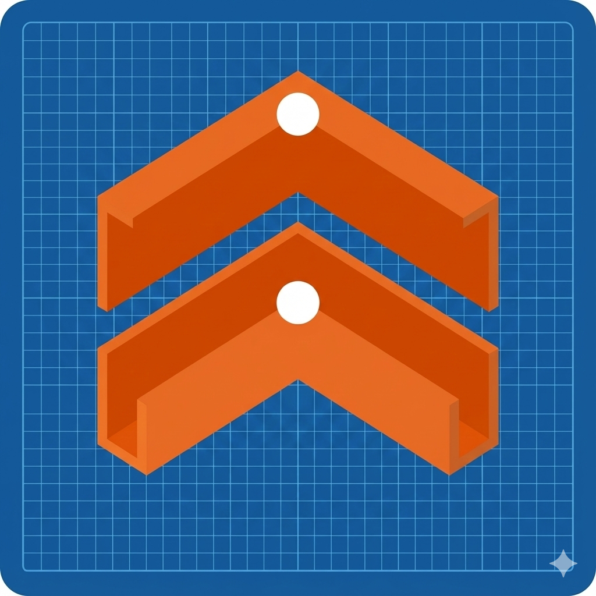

<p align="center">
  
  <br>
  <b>Design, iterate, and preview CadQuery models with ease.</b>
</p>

---

# Cadet

Cadet is an **experimental** Tauri + React desktop app for exploring script-driven CAD workflows.
Models are authored in **Python using the CadQuery library**, and the app provides an editor + language tooling plus a 3D viewport for previewing generated STL geometry.

> **Status: very experimental / moving target**
>
> This project is under active development and is subject to change without notice.
> Expect rough edges: bugs, breaking changes, incomplete features, and evolving file formats/APIs.

## What it is

- Desktop app built with **Tauri (Rust)** + **React**
- Monaco-based editor experience with a bundled language server integration
- 3D STL preview viewport (Three.js)

## Writing Models

Cadet expects your Python scripts to define a `result` variable containing the final CadQuery object. This is what the app exports to the 3D viewport.

```python
import cadquery as cq

# The app looks for the 'result' variable
result = cq.Workplane("XY").box(10, 10, 10)
```

## Development

This repo uses **Bun** and **mise**.

### Prerequisites

- `mise` (recommended for consistent tool versions)
- Rust toolchain + Tauri prerequisites for your OS
- Python 3.12+ with the CadQuery dependency installed

### Setup

- Install toolchain versions: `mise install`
- Install JS deps: `bun install`
- Install Python deps into `.venv`: `python -m pip install -e .`

### Common tasks (mise)

- Dev: `mise run dev`
- Build: `mise run build`
- Generate icons: `mise run icon`

## `ty` binary

`ty` is **packaged with the app** (end users shouldn’t need to install it).
It serves as the Language Server Protocol (LSP) backend, providing autocompletion and error checking in the editor.

For local development, you need the correct `ty` binary for your platform:

- Download it from the `ty` GitHub releases
- Place it at `src-tauri/bin/ty` (create the `src-tauri/bin` directory if needed)

## Python / model generation

Cadet expects models to be defined using **CadQuery**.
If `python3` is not on your GUI app PATH, or you want to use a specific virtualenv,
set `CADET_PYTHON` to the full path of the Python interpreter.

## Linux packaging notes

The Debian package stays small by not bundling Python/CadQuery directly. Instead, it installs a dedicated virtual environment at `/var/lib/cadet/.venv` and attempts to install CadQuery automatically via a post-install script.
It requires `python3`, `python3-venv`, and `python3-pip` to be available on your system.

## Recommended IDE Setup

- VS Code + Tauri extension + rust-analyzer
